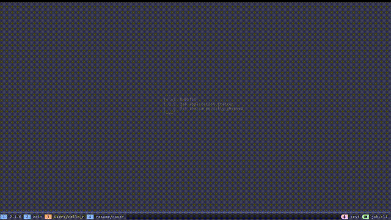
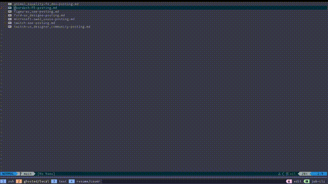

# GHOSTED 👻

```
     .-.
    (o o)  GHOSTED
    | O |  job application tracker
    |   |  for the perpetually ghosted
    '~~~'
```

A terminal-based job application tracker for those of us who know the void all too well.

Built with Go and [Charm](https://charm.sh) libraries.

## Demo

### TUI Overview
Navigate, search, filter, and manage your job applications from the terminal.



### AI Agent Integration
Drop a job posting into `local/postings/` and let an AI agent (like Claude Code) extract the details and add it to your tracker.



### Edit Agent-Created Entries
Review and update the status of AI-created entries directly from the TUI.


## Features

- **Interactive TUI** - Full keyboard-driven interface with vim-style navigation
- **CLI Commands** - Script-friendly commands for automation and AI agents
- **JSON Storage** - Human-readable data format, easy to backup and version control
- **Status Pipeline** - Track applications from saved → applied → ghosted into oblivion
- **Search & Filter** - Quickly find applications by company, position, or status
- **Quick Actions** - Change status with single keystrokes (1-8)
- **Fetch Command** - Auto-fetch job postings from Lever, Greenhouse, LinkedIn, and more
- **Agent Pipeline** - Multi-agent system for automated resume and cover letter generation

## Installation

### From Source (Recommended)

```bash
git clone https://github.com/celloopa/ghosted.git
cd ghosted
make install
```

This installs `ghosted` to your Go bin directory (`~/go/bin` by default).

Make sure it's in your PATH:
```bash
export PATH="$HOME/go/bin:$PATH"
```

### Go Install (Latest Release)

```bash
go install github.com/celloopa/ghosted@latest
```

## Usage

### Interactive TUI

```bash
ghosted
```

**Keyboard Shortcuts:**

| Key | Action |
|-----|--------|
| `j`/`k` or arrows | Navigate up/down |
| `a` | Add new application |
| `e` | Edit selected |
| `d` | Delete selected |
| `Enter` | View details |
| `1-8` | Quick status change |
| `/` | Search |
| `f` | Filter by status |
| `c` | Clear filters |
| `?` | Toggle help |
| `q` | Quit |

**Status Keys:**
1. Saved
2. Applied
3. Screening
4. Interview
5. Offer
6. Accepted
7. Rejected
8. Withdrawn

### CLI Commands

```bash
# Add new application
ghosted add --json '{"company":"Acme","position":"Engineer","salary_min":150000}'

# List all applications
ghosted list
ghosted list --json

# Get single application (supports partial ID)
ghosted get abc123
ghosted get abc123 --json

# Update application
ghosted update abc123 --json '{"status":"interview","notes":"Phone screen scheduled"}'

# Delete application
ghosted delete abc123

# Fetch job posting from URL
ghosted fetch https://jobs.lever.co/company/job-id
ghosted fetch --output acme-swe.md https://example.com/job

# Fetch CV from website
ghosted cv fetch cello.design
# Downloads https://cello.design/cv.json → local/cv.json

# Help
ghosted help
```

### Fetch Command

Automatically fetch and save job postings from popular job boards:

```bash
ghosted fetch <url>
```

**Supported job boards:**
- Lever (`jobs.lever.co`)
- Greenhouse (`boards.greenhouse.io`)
- Workday
- LinkedIn Jobs
- Ashby
- Generic HTML pages

The command extracts company name and position, converts the posting to markdown, and saves it to `local/postings/`.

### CV Fetch Command

Fetch your CV/resume data from a website that hosts a JSON Resume file:

```bash
ghosted cv fetch <website>
```

This downloads `https://<website>/cv.json` and saves it to `local/cv.json`. If a CV already exists, a timestamped backup is created before overwriting.

```bash
ghosted cv fetch cello.design
# Output:
# Fetching CV from: https://cello.design/cv.json
# Backup created: local/cv.backup.2026-01-16-114047.json
# CV saved to: local/cv.json
# Size: 9900 bytes
# Name: Marcelo Rondon
# Title: Front-End Developer | Designer
```

## Data Storage

By default, data is stored at:
```
~/.local/share/ghosted/applications.json
```

Override with environment variable:
```bash
export GHOSTED_DATA=/path/to/your/applications.json
```

### Sample Data

New installations are seeded with 3 sample applications to help you get started. Delete them with `d` in the TUI or start fresh:

```bash
rm ~/.local/share/ghosted/applications.json
```

## JSON Schema

```json
{
  "company": "string (required)",
  "position": "string (required)",
  "status": "saved|applied|screening|interview|offer|accepted|rejected|withdrawn",
  "date_applied": "2025-01-15T00:00:00Z",
  "salary_min": 150000,
  "salary_max": 200000,
  "job_url": "https://...",
  "location": "City, State",
  "remote": true,
  "contact_name": "string",
  "contact_email": "string",
  "resume_version": "string",
  "cover_letter": "string",
  "notes": "string",
  "interviews": [
    {
      "date": "2025-01-20T14:00:00Z",
      "type": "phone|video|onsite|technical",
      "notes": "string",
      "with_whom": "string"
    }
  ]
}
```

See [schema.json](schema.json) for the complete JSON Schema specification.

## Local Files (Optional)

For organizing job-related documents, create a `local/` directory:

```
local/
├── postings/       # Job posting files (txt, md, png)
├── resumes/        # Resume versions
└── cover-letters/  # Cover letter templates
```

This directory is gitignored by default.

## Agent Pipeline

Ghosted includes a multi-agent document generation pipeline for automating job applications:

| Agent | Purpose |
|-------|---------|
| **Parser** | Extracts structured JSON from job postings |
| **Resume Generator** | Creates tailored Typst resumes with skill matching |
| **Cover Letter Generator** | Generates personalized cover letters |
| **Reviewer** | Scores documents like a hiring manager (70+ to pass) |
| **Tracker Integration** | Generates CLI commands to add applications |

Prompt templates are in `internal/agent/prompts/`. See [CLAUDE.md](CLAUDE.md) for integration details.

## Development

### Project Structure

```
├── main.go                 # Entry point, CLI commands
├── internal/
│   ├── agent/              # Agent pipeline implementation
│   │   ├── prompts/        # Agent prompt templates (parser, resume, cover, reviewer, tracker)
│   │   ├── resume.go       # Resume generator agent
│   │   ├── cover.go        # Cover letter generator agent
│   │   ├── reviewer.go     # Hiring manager review agent
│   │   └── tracker.go      # Tracker integration agent
│   ├── fetch/              # URL fetching and job board parsing
│   ├── model/
│   │   └── application.go  # Data structures, status constants
│   ├── store/
│   │   └── json.go         # JSON persistence, CRUD operations
│   └── tui/
│       ├── app.go          # Main TUI controller
│       ├── list.go         # List view
│       ├── detail.go       # Detail view
│       ├── form.go         # Add/edit form
│       ├── styles.go       # Lip Gloss styling
│       └── keys.go         # Key bindings
├── samples/
│   └── applications.json   # Sample data for new users
└── schema.json             # JSON Schema specification
```

### Building

```bash
make build    # Build binary locally
make install  # Build and install to ~/go/bin
make clean    # Remove local binary
```

### Dependencies

- [Bubble Tea](https://github.com/charmbracelet/bubbletea) - TUI framework
- [Bubbles](https://github.com/charmbracelet/bubbles) - TUI components
- [Lip Gloss](https://github.com/charmbracelet/lipgloss) - Styling

## Changelog

See [CHANGELOG.md](CHANGELOG.md) for recent updates.

## License

MIT License - see [LICENSE](LICENSE) for details.

## Contributing

Contributions welcome! Please feel free to submit a Pull Request.

---

*Built with tears and mass rejection emails* 💀
